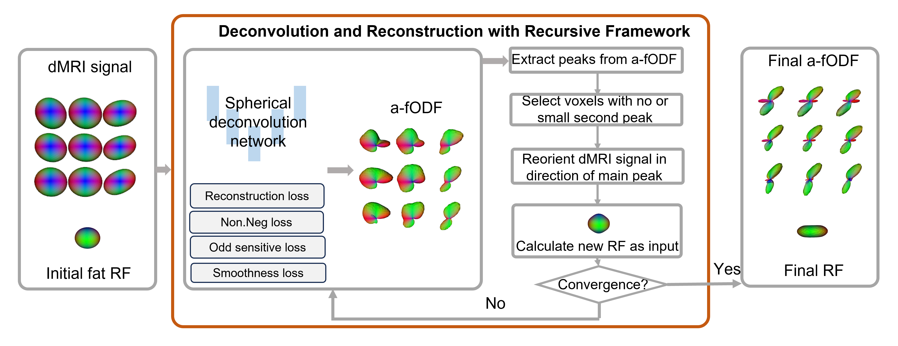

# a-fODFs recursive net
Code for paper "Unsupervised Deep Learning-based Asymmetric Fiber Orientation Distribution Functions Estimation on diffusion MRI"


## Setup
The main environment is:
- cuda 11.3
- torch 1.11.0
- nibabel 4.0.2
- PyGSP 0.5.1 (``` pip install git+https://github.com/epfl-lts2/pygsp.git@39a0665f637191152605911cf209fc16a36e5ae9#egg=PyGSP ```)
- dipy 1.7.0
- scipy 1.8.0

## Datasets
You need to create a folder containing the dmri data. The file name in this folder must be: 
1. dmri image: ```dmri_data.nii.gz ```
2. bvals file: ```bvales.bvals```
3. bvecs file: ```bvecs.bvecs```

## Train Model and Inference on your data
``` 
bash estimate.sh
```
> [Notice]
>
> Partial codes are coming soon...

<!-- ## References
Thanks to the code of <a href=https://github.com/AxelElaldi/e3so3_conv>e3so3_conv</a>, this is the project we rely on.
Please cite the following papers for using the code and/or the training data:
```
Elaldi A, Gerig G, Dey N, 
“E(3)xSO(3)-Equivariant Networks for Spherical Deconvolution in Diffusion MRI”, 
in Proceedings of the Medical Imaging with Deep Learning,
pp. 301-319, 2024.
``` -->